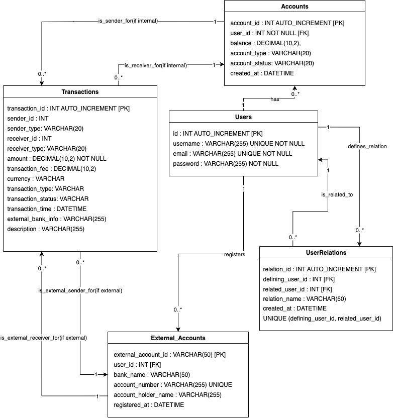

# Project-PayMyBuddy
Pay My Buddy: An application for easy money transfers between contacts.

## Physical Database Model (PDM)

-----

## Tech Stack
### Language & Runtime
- Java 17
- Maven (build & dependency management)

### Framework (Spring Boot)
- Spring Boot 3.5.4
  - spring-boot-starter-web — REST controllers, MVC
  - spring-boot-starter-thymeleaf — server-side template rendering
  - spring-boot-starter-security — authentication & authorization
  - spring-boot-starter-data-jpa — ORM with Hibernate/JPA
  - spring-boot-starter-data-jdbc — direct JDBC access (lightweight alternative to JPA)
  - spring-boot-starter-validation — Bean Validation (Jakarta Validation)
  - spring-boot-devtools — developer tools (hot reload)

### View Layer
- Thymeleaf
- thymeleaf-extras-spring security6

### Persistence & Database
- JPA / Hibernate
- JDBC
- MySQL Connector/J
- H2 Database

### Authentication & JWT
- JJWT 0.12.6 — JSON Web Token library
- jjwt-api, jjwt-impl (runtime), jjwt-jackson (runtime)

### Testing & QA
- spring-boot-starter-test (JUnit, AssertJ, Hamcrest, etc.)
- spring-security-test
- JUnit Jupiter API 5.12.2
- Mockito 5.17.0 (mockito-core, mockito-junit-jupiter)
- JaCoCo 0.8.13
- maven-surefire-plugin 3.2.5

### Code Generation / Annotations
- Lombok 1.18.38

-----

## Feature
### 1. Authentication Service
- Register (`/signup`)
- Log in (`/login`)
- Log out (`/logout`)

### 2. Profile Service
- Update profile (`/profile`)

### 3. Relation Service
- Add relation by email (`/relations/new`)

### 4. Transaction Service
- Transfer money to related users (`/accounts/{accountId}/transfer`)
- View transactions of the logged-in user (`/transfer`)

----- 

## Security
- Authentication & Authorization implemented with **Spring Security & JWT**

